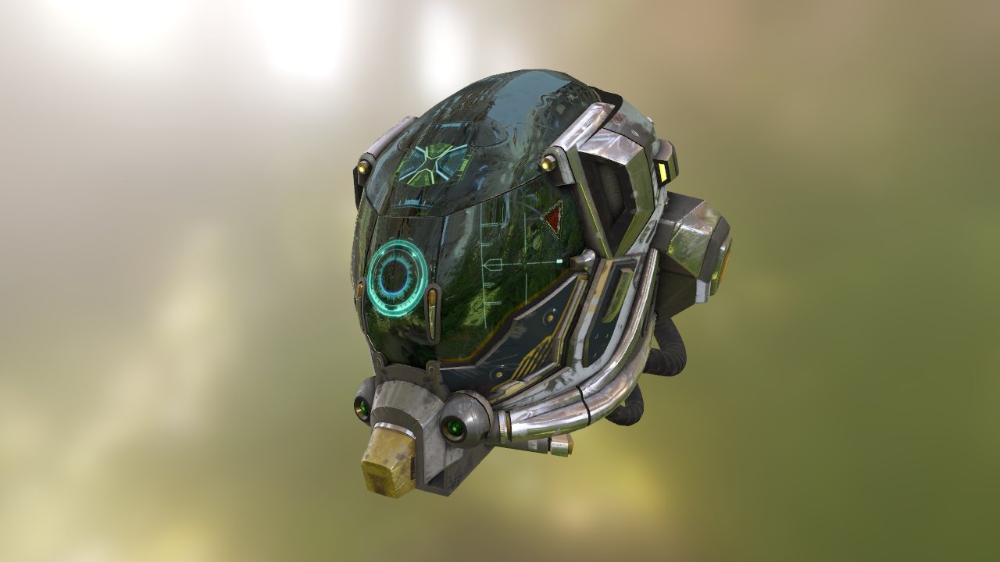

# Vulkan glTF PBR Renderer

<p align="center">
  
</p>

A small Vulkan renderer for glTF 2.0 models, based on
[Sascha Willems' Vulkan-glTF-PBR](https://github.com/SaschaWillems/Vulkan-glTF-PBR).
It provides a compact PBR rendering baseline with separate application, scene,
resource, and rendering layers.

## Current features

- glTF 2.0 model loading with metallic-roughness PBR and image-based lighting.
- Skybox, irradiance map, prefiltered environment map, and BRDF LUT generation.
- Explicit `FrameContext` synchronization and swapchain resize handling.
- Vulkan debug labels, object names, timestamp queries, and an ImGui timing panel.
- Generation-based resource handles and deferred GPU resource destruction.
- `RenderScene` extraction that separates scene representation from render execution.
- Timeline-semaphore-driven staging ring allocation for asynchronous buffer uploads.

## Known upload limitations

The staging ring currently covers buffer-to-buffer uploads used by model vertex
and index data. A few call sites still use their previous staging or immediate-submit
paths, and image uploads (`vkCmdCopyBufferToImage`) have not yet been migrated.

## Project layout

```text
app/                 Application composition, window loop, and ImGui UI
engine/core/         Vulkan device, swapchain, buffers, and staging ring
engine/resource/     glTF models, textures, environments, and resource manager
engine/scene/        Camera, scene description, and render-scene extraction
engine/render/       Renderer, render passes, and RenderScene data
engine/platform/     Platform window abstraction
data/                Models, environments, textures, and shaders
external/            Third-party dependencies
```

## Building

The primary development configuration is Windows with Vulkan SDK, CMake, Ninja,
MinGW GCC, Python 3, and a C++20 compiler.

Clone the repository with submodules:

```bash
git clone --recursive https://github.com/GitHupMuxin/vulkan_renderer.git
cd vulkan_renderer
```

Configure and build with the included preset:

```bash
cmake --preset gcc-ninja
cmake --build --preset gcc-ninja
```

Shader compilation is part of the build. The Python executable is currently
configured in `app/CMakeLists.txt`; adjust that path for your local environment.

## Credits

- Original renderer: [Sascha Willems — Vulkan-glTF-PBR](https://github.com/SaschaWillems/Vulkan-glTF-PBR)
- glTF loading: [tinygltf](https://github.com/syoyo/tinygltf)
- glTF specification: [Khronos glTF](https://github.com/KhronosGroup/glTF)

See [LICENSE](LICENSE) for licensing information.
